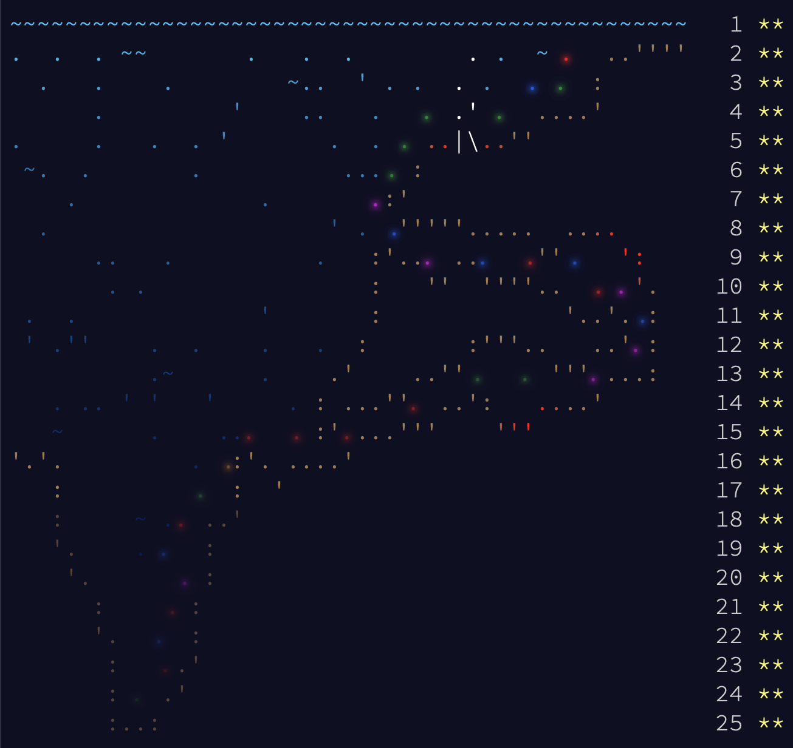

<h1 align="center">AdventOfCode</h1>

<h3 align="center">My solutions to the <a href="https://adventofcode.com/">adventofcode.com</a> puzzles.</h3>

<hr>

<div align="center">


</div>

> Advent of Code is an Advent calendar of small programming puzzles for a variety of skill sets and skill levels that can be solved in any programming language you like. People use them as interview prep, company training, university coursework, practice problems, a speed contest, or to challenge each other.

## Table of Contents

- [About](#about)

- [Getting Started](#getting-started)
    - [Prerequisites](#prerequisites)
    - [Installation](#installation)



> The calendar for the 2021 event.


## About

This repository contains my solutions to the Advent of Code puzzles. I try to solve the puzzles in different programming languages (C++, Golang, Python), so that I can learn new languages and improve my skills in the ones I already know.

## Getting Started

### Prerequisites

- C++ compiler (e.g. g++)
- Golang compiler (e.g. go)

### Installation

1. Clone the repo

```sh
git clone https://github.com/Matbabs/AdventOfCode.git
```

2. Compile the code

```sh
g++ 1.cpp -o 1
```
```sh
go build 1.go
```

3. Run the code

```sh
./1
```
```sh
python3 1.py
```

## Contact

Matbabs - [@_Matbabs](https://twitter.com/_Matbabs)
